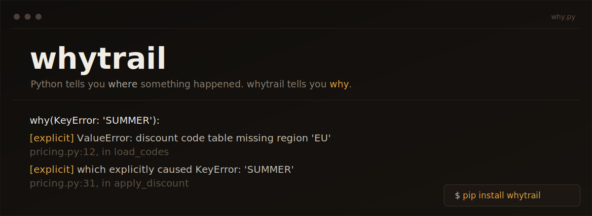

<p align="center">
  <a href="https://pypi.org/project/whytrail/">
    
  </a>
</p>

## Two tiers, one function

**Tier 1 -- zero configuration.** `why(some_exception)` reassembles a causal
chain from data CPython already retains: `__traceback__`, `__cause__`,
`__context__`, and the locals of the frame where it actually originated.
No setup, no tracing engine, no overhead when unused.

**Tier 2 -- opt-in, scoped.** `why(some_tracked_value)` walks a small
provenance graph built only for values you deliberately watched:

```python
import whytrail

with whytrail.trace():
    raw = whytrail.track(fetch_row(), label="raw CSV row")
    price = whytrail.track(float(raw["price"]), derived_from=raw)

print(whytrail.why(price))
```

Something that was never tracked gets an honest answer, not a guess:

```
why(3.14): unknown -- no provenance captured.
  This value was never tracked. Wrap it with whytrail.track(),
  @whytrail.tracked, or raise it as an exception to get an answer.
```

`whytrail` will never fabricate a causal chain it isn't sure about. See
[`docs/adr/0001-whytrail-architecture.md`](docs/adr/0001-whytrail-architecture.md)
for the full reasoning behind that design choice, and why a fully automatic
`why(anything)` isn't possible in the first place.

## Install

```bash
pip install whytrail          # core, zero dependencies
pip install whytrail[rich]    # + Explanation.rich() tree rendering
pip install whytrail[cli]     # + the `whytrail` CLI
```

## Why not just use a debugger / logging / OpenTelemetry?

Each answers a different question:

| Tool | Answers |
|---|---|
| `pdb` / IDE debugger | What is the state *right now*, interactively |
| `logging` | Whatever you decided in advance to record |
| `traceback` | *Where* it crashed |
| OpenTelemetry | Cross-service request flow |
| `whytrail` | What produced *this specific value*, on demand, after the fact |

## Public API

Five verbs (`why`, `track`, `tracked`, `trace`, `register`) plus two
persistence helpers (`snapshot`, `restore`). Domain-specific integrations
are separate plugin packages, not new verbs -- see `docs/plugin-guide.md`.

## Ecosystem

30 plugins today, each earning its place by clearing one of three bars
(structured error data, a security-sensitive boundary, or a non-standard
capture mechanism) rather than existing just to exist -- see
`docs/adr/0003-ecosystem-scale-triage.md` for the full reasoning, the
next candidates, and the much longer list of libraries deliberately
*not* wrapped, because generic `track()`/`@tracked` already covers them
with zero extra code. Full table with what each one adds:
`docs/plugin-guide.md`.

| | | |
|---|---|---|
| `whytrail-requests` | `whytrail-httpx` | `whytrail-aiohttp` |
| `whytrail-huggingface-hub` | `whytrail-openai` | `whytrail-anthropic` |
| `whytrail-boto3` | `whytrail-google-cloud` | `whytrail-sqlalchemy` |
| `whytrail-asyncpg` | `whytrail-pymongo` | `whytrail-grpcio` |
| `whytrail-pydantic` | `whytrail-marshmallow` | `whytrail-jsonschema` |
| `whytrail-pyyaml` | `whytrail-pandas` | `whytrail-polars` |
| `whytrail-sentry` | `whytrail-ddtrace` | `whytrail-celery` |
| `whytrail-rq` | `whytrail-dramatiq` | `whytrail-prefect` |
| `whytrail-scrapy` | `whytrail-pytest` | `whytrail-fastapi` |
| `whytrail-django` | `whytrail-flask` | `whytrail-langchain` |

`python scripts/new_plugin.py <library> --kind explainer|integration`
scaffolds a new one. `.github/actions/whytrail-run` packages the CLI as a
GitHub Action for CI.

**On test coverage:** every plugin above is verified against a real
object from the real library, not a mock, and every plugin's stated
minimum dependency version is confirmed to actually install and work on
the newest supported Python -- both caught real bugs, twenty of them
version-compatibility gaps invisible from the version number alone,
eight of those found only once this project's CI actually ran on real
Linux for the first time rather than the Windows sandbox it was built in
(see `CHANGELOG.md`). It is not the same claim as "battle-tested in
every condition": see `docs/testing-maturity.md` for exactly what is and
isn't covered (the full Python 3.10-3.13 matrix, concurrency beyond the
three web frameworks, and full exception-surface breadth are the current
gaps).

## Status

Pre-1.0. The public API may still change between minor versions. See
`CHANGELOG.md` for what's shipped at each version and `docs/adr/` for the
architecture this was built from:

- [`0001`](docs/adr/0001-whytrail-architecture.md) -- feasibility and the
  original two-tier architecture.
- [`0002`](docs/adr/0002-category-strategy.md) -- category positioning
  and the pre-1.0 API fixes it drove.
- [`0003`](docs/adr/0003-ecosystem-scale-triage.md) -- how the plugin
  ecosystem scales (and how it doesn't).
- [`0004`](docs/adr/0004-rename-to-whytrail.md) -- why this project is
  called `whytrail` and not `butwhy`.
- [`0005`](docs/adr/0005-vscode-extension-scope.md) -- VS Code extension
  scope assessment (not started, and why).

Full documentation site (same content, easier to browse):
https://bhouvana.github.io/Whytrail/
