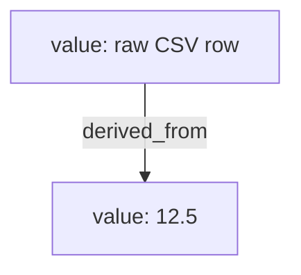

# whytrail

[](https://pypi.org/project/whytrail/)
[](https://github.com/bhouvana/Whytrail/actions/workflows/ci.yml)
[](https://pypi.org/project/whytrail/)
[](LICENSE)

Python tells you *where* something happened. `whytrail` tells you *why
a value has the value it has.*

The same way a traceback already answers "where did this crash," `why()`
answers "why does this specific value look like this" -- for an
exception (zero setup) or anything else you deliberately track. See
[`docs/adr/0010-positioning-why-not-where.md`](docs/adr/0010-positioning-why-not-where.md)
for the full reasoning, and why exceptions below are the fastest thing
to show, not the whole story (see "Not just exceptions" further down).

## See it in 10 seconds, zero code

```
$ pip install whytrail
$ whytrail demo
```

```
A real exception, explained with zero setup -- this is why(exc):

why(KeyError: 'SUMMER'):
  [explicit] ValueError: discount code table missing region 'EU'  [<whytrail demo>:4, in load_codes]
      locals: region='EU', table={}
  [explicit] which explicitly caused KeyError: 'SUMMER'  [<whytrail demo>:11, in apply_discount]
      locals: price=12.5, code='SUMMER'

That's a Tier 1 answer: zero config, reconstructed entirely from data
CPython already retains for every exception (__traceback__, __cause__,
__context__). Add this near the top of your own program and every
uncaught exception shows this automatically, not just this demo:

    import whytrail
    whytrail.install()
```

(Real output -- `whytrail demo` actually raises the exception shown and
runs `why()` on it; with `pip install whytrail[rich]` it renders as a
panel/tree instead of plain text, the same rendering `.rich()` uses
everywhere else.) No script to write, no exception to cause on
purpose -- this is the fastest way to see what every uncaught exception
in your own program looks like once you add the two lines below.

## Install once. See it on every crash.

```python
import whytrail
whytrail.install()
```

Two lines, anywhere near the top of your program. From then on, every
uncaught exception -- main thread, a background thread, the interactive
REPL -- prints the causal chain first, then the traceback you already
know, unchanged:

```
$ python crash.py
why(KeyError: 'SUMMER'):
  [explicit] ValueError: discount code table missing region 'EU'  [crash.py:7, in load_codes]
  [explicit] which explicitly caused KeyError: 'SUMMER'  [crash.py:14, in apply_discount]

Traceback (most recent call last):
  File "crash.py", line 12, in apply_discount
    load_codes("EU")
  File "crash.py", line 7, in load_codes
    raise ValueError(f"discount code table missing region {region!r}")
ValueError: discount code table missing region 'EU'

The above exception was the direct cause of the following exception:

Traceback (most recent call last):
  File "crash.py", line 16, in <module>
    apply_discount(12.5, "SUMMER")
  File "crash.py", line 14, in apply_discount
    raise KeyError(code) from exc
KeyError: 'SUMMER'
```

Nothing is removed -- the full traceback still prints, exactly as
before. What's new is the two lines above it: root cause first
(`ValueError` at the actual `load_codes` call), then what it caused
(`KeyError`, three frames later), reconstructed entirely from
`__traceback__`/`__cause__`/`__context__` -- data CPython already
retains for every exception, whether or not `whytrail.install()` was
ever called. `install()` doesn't add new capture, it just makes that
zero-config answer automatic instead of something you have to remember
to ask for.

Same mechanism as `rich.traceback.install()`, checked against two real
gaps most naive versions of this miss: it also hooks
`threading.excepthook` (an uncaught exception in a worker thread never
reaches `sys.excepthook` at all -- confirmed directly, not assumed),
and locals are redacted by default (`whytrail.install(log_locals=True)`
to opt in) since this hook's output often ends up somewhere off-box
(journald, a container's stdout capture, a CI log) that whytrail
doesn't control.

## Two tiers, one function

**Tier 1 -- zero configuration.** `why(some_exception)` reassembles a causal
chain from data CPython already retains: `__traceback__`, `__cause__`,
`__context__`, and the locals of the frame where it actually originated.
No setup, no tracing engine, no overhead when unused.

**Tier 2 -- opt-in, scoped.** `why(some_tracked_value)` walks a small
provenance graph built only for values you deliberately watched:

```python
import whytrail

with whytrail.trace():
    raw = whytrail.track(fetch_row(), label="raw CSV row")
    price = whytrail.track(float(raw["price"]), derived_from=raw)

print(whytrail.why(price))
```

Something that was never tracked gets an honest answer, not a guess:

```
why(3.14): unknown -- no provenance captured.
  This value was never tracked. Wrap it with whytrail.track(),
  @whytrail.tracked, or raise it as an exception to get an answer.
```

This is the whole design in one line: **provenance-first debugging --
explicit capture, honest confidence, and it never fabricates an answer
it isn't sure of.** Most observability tools infer (a profiler samples,
a tracer instruments everything reachable); whytrail asks you to mark
what matters and, in return, answers questions inference can't answer
reliably. See
[`docs/adr/0001-whytrail-architecture.md`](docs/adr/0001-whytrail-architecture.md)
for the full reasoning behind that design choice, and why a fully automatic
`why(anything)` isn't possible in the first place.

`whytrail.why(price).graph()` renders that same chain as an actual
diagram (real output, from the example above, not a mockup):



## Not just exceptions

Exceptions are the fastest thing to demo (zero setup, `whytrail.install()`
and you're done) -- they aren't the definition of what whytrail
explains. Underneath both tiers is one general causal-explanation
engine: a typed provenance graph (`Node`/`Edge`) plus a type-keyed
resolution order
(`__why__` protocol, then the plugin registry, then the graph). Nothing
in that core assumes its subject is an exception or a `track()`ed
value specifically -- those are its first two consumers, not its
limit. `whytrail.config` is a second one, shipped, not hypothetical:
`env()` resolves a setting from the process environment, a parsed
`.env` mapping, or a default, and records *which one it actually used*
into the same graph `track()` writes to:

```python
import whytrail
import whytrail.config

with whytrail.trace():
    timeout = whytrail.config.env("TIMEOUT", 30, cast=int)

print(whytrail.why(timeout))
```

```
why(30):
  [explicit] external: default value for 'TIMEOUT' (checked the environment, not found)
  [explicit] value: TIMEOUT=30
```

A missing key with no default raises `whytrail.config.ConfigError` --
a normal exception, so Tier 1 already explains *that* for free, no
separate explainer needed. See
[`docs/adr/0007-explanation-engine-reframe.md`](docs/adr/0007-explanation-engine-reframe.md)
for the reasoning, and
[`docs/plugin-guide.md`](docs/plugin-guide.md) for writing a plugin
that explains a type of your own the same way.

## Plain-English output

`whytrail.why(exc).text` is terse and technical, by design. For someone
who doesn't read tracebacks for a living, `.plain_text` renders the exact
same facts as prose, with general guidance for common exception types --
paraphrase, not new information, same honesty guarantee as `.text`:

```
Here's what happened, from the root cause to the final result:

1. ValueError -- got a value that didn't make sense for what it was doing (discount code table missing region 'EU') -- in load_codes(), line 12 of pricing.py
   At that point: region was 'EU', table was {}.
   How to avoid this: validate the value before using it, or check what produced it further up this chain.
2. KeyError -- tried to look up something that wasn't there ('SUMMER') -- in apply_discount(), line 31 of pricing.py
   At that point: price was 12.5, code was 'SUMMER'.
   How to avoid this: check the key exists before accessing it (`if key in d`), or use `d.get(key, default)` instead of `d[key]`.
```

## Install

```bash
pip install whytrail            # core, zero dependencies
pip install whytrail[rich]      # + Explanation.rich() tree rendering
pip install whytrail[cli]       # + the `whytrail` CLI
pip install whytrail[requests]  # + auto-explain requests.RequestException, etc.
pip install whytrail[all]       # every integration below, one install
```

One package, one version -- all integrations below are extras of
`whytrail` itself, not separate PyPI packages (ADR 0006). `pip install
whytrail[X]` pulls in exactly the library `X` explains, nothing else;
`why()` picks it up automatically the moment it's installed, no further
setup. `whytrail plugins` (needs the `cli` extra) lists all 63 and
whether each is actually active in your current environment:

```bash
$ whytrail plugins
Auto-registering (explainer-shaped), active in this environment: 27/43
  [x] requests
  [x] httpx
  [ ] stripe
  ...
Integration-shaped (need explicit install()/wiring in your code): 20/20 importable
  [x] fastapi
  [x] django
  ...
```

`whytrail run script.py` runs a script and, on an uncaught exception,
prints `why()` instead of a bare traceback:

```bash
whytrail run --json script.py    # machine-readable output
whytrail run --graph script.py   # also print the Mermaid provenance graph
```

**Flags go before the script path, not after.** `script_args` has to
swallow everything after `script` so a script's own flags reach it
unmolested (`whytrail run script.py --verbose` should pass `--verbose`
to *your* script) -- which means `whytrail run script.py --json` silently
does nothing: `--json` becomes part of your script's own arguments
instead of whytrail's. The CLI warns on stderr when this happens
rather than failing silently, but the fix is just word order.

## Why not just use a debugger / logging / OpenTelemetry?

Each answers a different question:

| Tool | Answers |
|---|---|
| `pdb` / IDE debugger | What is the state *right now*, interactively |
| `logging` | Whatever you decided in advance to record |
| `traceback` | *Where* it crashed |
| OpenTelemetry | Cross-service request flow |
| `whytrail` | What produced *this specific value*, on demand, after the fact |

## Performance

Real numbers, not estimates -- from
[`benchmarks/test_overhead.py`](benchmarks/test_overhead.py) (`pytest
benchmarks/ --benchmark-only`) and a direct `-X importtime` measurement,
both on CPython 3.13:

| What | Cost |
|---|---|
| A plain, untracked function call | ~77ns (baseline) |
| `@tracked` function call, no `trace()` scope open | ~265ns -- still sub-microsecond |
| `@tracked` function call, actively capturing inside `trace()` | ~8.8us |
| `why()` on an untracked object (the honest-unknown path) | ~4.0us |
| `import whytrail`'s own cumulative cost | ~50ms |

The "no overhead when unused" claim above is specifically about
`@tracked`/`track()` outside an open `trace()` scope -- the state
almost all code is in almost all the time -- not "tracing is free while
active." Measuring `import whytrail` honestly (via `-X importtime`) is
also how a real, fixable cost was found and cut during this
measurement: `registry.py` imported `importlib.metadata` eagerly at
module load even though it's only needed the first time a plugin's
entry point is actually resolved, costing ~30ms of every `import
whytrail` for code that may never hit that path. Made lazy; cumulative
import cost dropped from ~77ms to ~50ms as a direct result -- see
`CHANGELOG.md`.

## Public API

Five verbs (`why`, `track`, `tracked`, `trace`, `register`) plus two
persistence helpers (`snapshot`, `restore`). Domain-specific integrations
are extras of this same package, not new verbs -- see
`docs/plugin-guide.md`.

## Ecosystem

63 integrations today -- 60 reached the original target this ecosystem
push was scoped against, plus `logging`/`structlog`/`loguru` since --
each earning its place by clearing one of three bars (structured error
data, a security-sensitive boundary, or a non-standard capture
mechanism) rather than existing just to exist -- see
`docs/adr/0003-ecosystem-scale-triage.md` for the
full reasoning, the next candidates, and the much longer list of
libraries deliberately *not* wrapped, because generic `track()`/
`@tracked` already covers them with zero extra code, or because they
were checked directly and found to carry no structured data beyond
what tier 1 already shows for free. Full table with what each one
adds: `docs/plugin-guide.md`.

| | | |
|---|---|---|
| `whytrail[requests]` | `whytrail[httpx]` | `whytrail[aiohttp]` |
| `whytrail[huggingface-hub]` | `whytrail[openai]` | `whytrail[anthropic]` |
| `whytrail[boto3]` | `whytrail[google-cloud]` | `whytrail[sqlalchemy]` |
| `whytrail[asyncpg]` | `whytrail[pymongo]` | `whytrail[grpcio]` |
| `whytrail[pydantic]` | `whytrail[marshmallow]` | `whytrail[jsonschema]` |
| `whytrail[pyyaml]` | `whytrail[pandas]` | `whytrail[polars]` |
| `whytrail[stripe]` | `whytrail[alembic]` | `whytrail[paramiko]` |
| `whytrail[elasticsearch]` | `whytrail[pika]` | `whytrail[kubernetes]` |
| `whytrail[azure-core]` | `whytrail[sendgrid]` | `whytrail[websockets]` |
| `whytrail[opensearch]` | `whytrail[pyodbc]` | `whytrail[google-genai]` |
| `whytrail[oracledb]` | `whytrail[confluent-kafka]` | `whytrail[pymysql]` |
| `whytrail[pymssql]` | `whytrail[clickhouse]` | `whytrail[snowflake]` |
| `whytrail[graphql-core]` | `whytrail[tenacity]` | `whytrail[psycopg]` |
| `whytrail[cassandra]` | `whytrail[influxdb]` | `whytrail[pyzmq]` |
| `whytrail[zeep]` | `whytrail[sentry]` | `whytrail[ddtrace]` |
| `whytrail[celery]` | `whytrail[rq]` | `whytrail[dramatiq]` |
| `whytrail[prefect]` | `whytrail[scrapy]` | `whytrail[pytest]` |
| `whytrail[fastapi]` | `whytrail[django]` | `whytrail[flask]` |
| `whytrail[langchain]` | `whytrail[newrelic]` | `whytrail[rollbar]` |
| `whytrail[honeybadger]` | `whytrail[elastic-apm]` | `whytrail[bugsnag]` |
| `whytrail[structlog]` | `whytrail[loguru]` | `logging` (stdlib, no extra) |

All of the above in one install: `pip install whytrail[all]`. Want to publish your
own, outside this repo, for a library not on this list?
`python scripts/new_plugin.py <library> --kind explainer|integration`
scaffolds that (ADR 0006 -- the entry-point extensibility mechanism the
bundled 30 used to use is still there for exactly this). `.github/actions
/whytrail-run` packages the CLI as a GitHub Action for CI.

**Real, runnable examples** for the frameworks above:
[`examples/ex_fastapi.py`](examples/ex_fastapi.py),
[`examples/ex_flask.py`](examples/ex_flask.py),
[`examples/ex_django.py`](examples/ex_django.py) (each shows the
safe-by-default production response next to the `debug=True` one, and
proves the secret local never leaks either way), and
[`examples/ex_pytest_fixtures.py`](examples/ex_pytest_fixtures.py)
(`pytest examples/ex_pytest_fixtures.py -v` -- a fixture-chain failure
explained automatically, zero whytrail-specific code in the test
itself). Every one of these is executed for real, not just written to
look plausible -- see their own docstrings for exact run commands.

**On test coverage:** every integration above is verified against a real
object from the real library, not a mock, and every one's stated minimum
dependency version is confirmed to actually install and work on the
newest supported Python -- both caught real bugs, twenty of them
version-compatibility gaps invisible from the version number alone,
eight of those found only once this project's CI actually ran on real
Linux for the first time rather than the Windows sandbox it was built in
(see `CHANGELOG.md`). It is not the same claim as "battle-tested in
every condition": see `docs/testing-maturity.md` for exactly what is and
isn't covered (the full Python 3.10-3.13 matrix, concurrency beyond the
three web frameworks, and full exception-surface breadth are the current
gaps).

## Status

Pre-1.0. The public API may still change between minor versions -- see
`docs/api-stability.md` for what's actually stable in practice versus
still moving. See `CHANGELOG.md` for what's shipped at each version and
`docs/adr/` for the architecture this was built from:

- [`0001`](docs/adr/0001-whytrail-architecture.md) -- feasibility and the
  original two-tier architecture.
- [`0002`](docs/adr/0002-category-strategy.md) -- category positioning
  and the pre-1.0 API fixes it drove.
- [`0003`](docs/adr/0003-ecosystem-scale-triage.md) -- how the plugin
  ecosystem scales (and how it doesn't).
- [`0004`](docs/adr/0004-rename-to-whytrail.md) -- why this project is
  called `whytrail` and not `butwhy`.
- [`0005`](docs/adr/0005-vscode-extension-scope.md) -- VS Code extension
  scope assessment (not started, and why).
- [`0006`](docs/adr/0006-unify-plugins-into-extras.md) -- why the 30
  integrations became extras of one package instead of 30 separate
  PyPI distributions.

Full documentation site (same content, easier to browse):
https://bhouvana.github.io/Whytrail/
