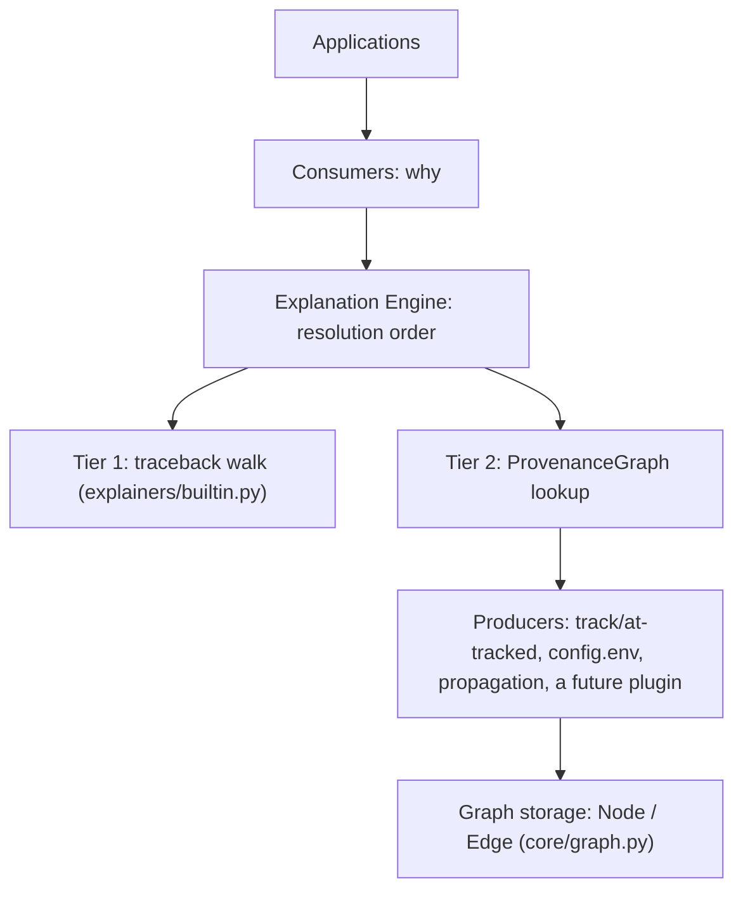

# The Explanation Engine

Internal architecture guide. Read this before writing a new producer
(a module that records provenance) or a new consumer (code that calls
`why()` and does something with the result). It describes what exists
today, checked against the code as of ADR 0008's audit -- not an
aspiration.

## What it is

A typed provenance graph (`ProvenanceGraph`, `Node`, `Edge` --
[`whytrail/core/`](../src/whytrail/core/)) plus a type-keyed resolution
order (`why()` in
[`whytrail/__init__.py`](../src/whytrail/__init__.py)). Three producers
write to it or answer through it today:

- **Tier 1** -- [`explainers/builtin.py`](../src/whytrail/explainers/builtin.py):
  reconstructs a causal chain for any exception from `__traceback__`/
  `__cause__`/`__context__`, entirely without the graph.
- **Tier 2 (values)** -- [`runtime/capture.py`](../src/whytrail/runtime/capture.py):
  `track()`/`@tracked` write `Node`/`Edge` data for anything a
  developer opted into inside a `trace()` scope.
- **Tier 2 (config)** -- [`config.py`](../src/whytrail/config.py):
  `env()` writes provenance for where a setting's value came from,
  using the same graph API as `track()`.

`whytrail/propagation.py` and `whytrail/integrations/langchain.py` are
two more real call sites writing into the same graph, neither part of
the "core" tiers above -- evidence the graph API is genuinely reusable,
not just documented as such.

## What it is not

- **Not a class hierarchy.** There is no `Producer` base class. Every
  producer above follows the same shape by convention (call
  `ProvenanceGraph.add_node()`/`add_edge()`), not by inheriting from
  anything. See ADR 0008 for why that's deliberate, not an oversight.
- **Not a unifier of Tier 1 and Tier 2.** `why()` on an exception
  never consults the graph, even if that exact exception object was
  separately given graph provenance. Two tiers, not one merged
  mechanism -- see "A boundary that stays a boundary" below.
- **Not always-on.** Every write to the graph (`track()`, `@tracked`,
  `config.env()`) is a no-op outside an open `trace()` scope. Nothing
  in the engine observes or records anything unless a developer opted
  in for that block of code.
- **Not a distributed tracing system.** `propagation.py` carries "which
  local chain led to this outbound call" across a process boundary;
  it does not merge a remote graph into the local one. Explicitly out
  of scope per ADR 0001.

## Layers

The engine layer (`C`/`D`/`E`) knows how to resolve `why(obj)` into an
`Explanation`. It does not know who wrote any given `Node` -- `core/`
never branches on `NodeKind.EXCEPTION` differently from
`NodeKind.EXTERNAL` or any other kind (confirmed by ADR 0008's audit,
invariant 2). Producers (`F`) know their own domain (an environment
variable, a tracked value, a cross-process boundary) and translate it
into `Node`/`Edge` calls; they never reach into `ProvenanceGraph`'s
internals (invariant 1 -- `core/serialize.py` is the one named
exception, and it says why in its own module docstring).

## Producers

A producer is any code that calls `ProvenanceGraph.add_node()` /
`add_edge()` (directly, or via `track()`) to describe where a value
came from. Writing one:

1. Decide what `NodeKind` best describes the thing you're recording
   (`VALUE` for a plain value, `EXTERNAL` for something crossing a
   boundary you don't control, `IMPORT` for something loaded from a
   file/module, `CALL` for a function boundary, `MUTATION` for an
   in-place change, `EXCEPTION` only for actual exceptions -- Tier 1
   already owns that one).
2. Call `graph.add_node(kind, label, obj=..., ...)` for the source,
   and again for the result if it isn't already a node (`node_for()`
   tells you if something's already tracked).
3. Link them with `graph.add_edge(source, target, EdgeKind.DERIVED_FROM, confidence=...)`
   (or another `EdgeKind` if the relationship isn't "derived from" --
   see `core/node.py` for the full list).
4. Respect capture gating: check `current_scope()`/`scope.should_capture()`
   before writing anything, the same way `track()` and `config.env()`
   both do. **Correctness of your function's return value must never
   depend on whether a scope is open** -- only whether the *provenance
   recording* happens does. `config.env()` is a working example to
   copy from.

That's the entire contract. No registration step, no interface to
implement -- `why()` finds anything reachable from a tracked object via
`ProvenanceGraph.node_for()` and `.ancestors()` automatically.

## Consumers

Anything that calls `why()`. Nothing here is producer-specific: `why()`
returns an `Explanation` the same shape regardless of whether the
answer came from Tier 1, a `track()`ed chain, a `config.env()` chain,
or an honest "unknown." A consumer that wants the raw graph instead of
the rendered summary uses `Explanation.nodes`/`.edges`/`.graph()`.

If you're writing a *type-specific* explainer (e.g. "explain
`requests.RequestException` with method/URL detail") rather than a
provenance producer, that's the plugin registry
(`register()`/`register_from_plugin()`, see
[`docs/plugin-guide.md`](plugin-guide.md)), a related but different
extension point -- it changes what `why()` says about a type it
already knows about; it doesn't add new graph data.

## Traversal

`ProvenanceGraph.ancestors(node_id, max_depth=...)` walks causal edges
backward, breadth-first, bounded by `max_depth`. Two properties this
depends on, both pinned by
[`tests/integration/test_engine_invariants.py`](../tests/integration/test_engine_invariants.py):

- **Cycle-safe.** A `visited_nodes` id-set means a node is only ever
  expanded once; a cycle in the graph (possible -- nothing prevents
  recording `A derived_from B derived_from A`) terminates instead of
  looping.
- **Deterministic for a fixed graph.** Calling `ancestors()` twice on
  the same graph state returns the same nodes and edges in the same
  order. (Insertion order across *concurrent* writers from different
  threads is not itself guaranteed deterministic -- that's a property
  of concurrent capture timing, not of the traversal algorithm.)

`why()`'s `_steps_from_traversal` then collapses the traversed subgraph
into one dominant path (highest-confidence parent at each step) for
`.text`/`.steps`; the full DAG stays available via `.nodes`/`.edges`/
`.graph()`. See ADR 0001 for why a summary-plus-full-picture split was
chosen over always rendering the complete DAG.

## Rendering

`Explanation.text`, `.plain_text`, `.json()`, and `.graph()`
(`core/explanation.py`) all read from the same `steps`/`nodes`/`edges`
data, but are allowed to be domain-aware in ways the graph itself is
not: `.plain_text` glosses common exception types
(`_EXCEPTION_GLOSS`/`_EXCEPTION_FIXES`) by checking
`ExplanationStep.kind == "exception"`. That's rendering choosing prose
for a value it's already been handed -- it does not mean the graph or
traversal know what an exception is (they don't; see ADR 0008 invariant
2). A future producer wanting similarly tailored prose would add its
own gloss table keyed the same way, entirely within `explanation.py`'s
rendering functions, with zero changes to `core/graph.py` or `why()`'s
resolution logic.

## Extension points, ranked by how stable they are

1. **A new producer module** (like `config.py`) -- lowest risk, most
   composable. Uses only `ProvenanceGraph`'s public API; needs no
   change anywhere else. This is the extension point every future
   "explain X" idea (a workflow run, a retry, a feature flag) should
   reach for first.
2. **A new type-specific explainer** (a plugin registering via
   `register()`) -- changes what `why()` says about a *type*, not what
   the graph stores. See `docs/plugin-guide.md`.
3. **A new `NodeKind`/`EdgeKind`** -- only if an existing kind
   genuinely doesn't describe the relationship (six of each exist
   today, deliberately broad). Check the existing list first; most new
   ideas fit `EXTERNAL` or `IMPORT` already, the way `config.py` did
   without adding anything.
4. **A change to `why()`'s resolution order, or to `ancestors()`'s
   traversal algorithm** -- highest risk, touches every producer and
   consumer at once. Requires an ADR, not a PR description, per ADR
   0008's "freeze the core" norm.

## Expressing common provenance patterns without new vocabulary

A Phase U review (ADR 0011) asked whether the graph's vocabulary is
rich enough to describe causality generally -- transformation
sequences, one value affecting several downstream consumers
(branching), a value assembled from several independent sources
(merging/override), and a value derived from two independent
provenances joining at one call (composition). All four are already
expressible with the primitives above, verified against real executed
output in `tests/integration/test_provenance_patterns.py` and
`examples/ex_provenance_patterns.py`, not just asserted from reading
this document:

- **Transformation sequence** -- decorate each step with `@tracked`;
  the call node's own label is the function's name, so
  `validate()` → `normalize()` → `clamp()` narrates as three named
  operations in order, no new label needed.
- **Branching** -- nothing limits a node to one outgoing edge. One
  `track()`ed value passed as `derived_from=` to two different children
  already produces two independent chains, each correctly tracing back
  to the shared parent. What doesn't exist: a single forward query
  ("what does this value affect") returning both children in one call
  -- named and deliberately deferred, `docs/roadmap.md` Phase F.
- **Merging / override** -- `whytrail.config.env()` already resolves a
  priority chain (environment > `.env` > default) and states not just
  which source won but *why the others didn't* ("not set in the
  process environment"). A new producer needing this pattern for a
  different set of sources can copy `config.py`'s shape directly.
- **Composition ("provenance algebra")** -- `@tracked`'s
  `_link_arguments` already links every argument's own node to the
  call node, regardless of how many arguments there are. Two
  independently-sourced values (e.g. two separately-resolved config
  values) converging on one constructor call already renders as a real
  join: `.text` flags it ("+N other paths converge here, see
  `.graph()`"), and `.graph()` shows the complete two-branch DAG.

None of these needed a new `NodeKind`/`EdgeKind` or a change to
`ancestors()`'s traversal -- see ADR 0008 invariant 2 ("`NodeKind`/
`EdgeKind` values are inert labels the engine stores and returns
without interpreting") for why patterns compose this freely without
the engine needing to understand them semantically.

## Anti-patterns

- **Reaching into `ProvenanceGraph._nodes`/`_edges` directly.** Use the
  public API. `core/serialize.py` is the one justified exception, and
  it says why in its own docstring -- a new producer citing that as
  precedent should stop and ask first.
- **Branching on producer identity inside `core/`.** If you find
  yourself wanting `if kind == "config"` anywhere under `whytrail/core/`
  or in `registry.py`/`protocols.py`, the feature belongs in your
  producer module or in `explanation.py`'s rendering layer instead --
  see ADR 0008 invariant 2.
- **Making capture correctness-affecting.** A producer function's
  *return value* must be identical whether or not a `trace()` scope is
  open. Only whether provenance gets recorded should depend on that --
  never whether the function's actual behavior does.
- **Assuming Tier 1 and the graph merge for exceptions.** They don't,
  on purpose (ADR 0001, reconfirmed in ADR 0008). Don't build a feature
  that only works if `why(some_exception)` starts consulting graph
  provenance -- that's a real core change, not something to route
  around quietly in a producer module.
- **Fabricating a chain when nothing was recorded.** `Explanation()`
  with no steps says so honestly. A producer with a genuinely missing
  value should let that show up as "unknown," not invent a plausible-
  looking node.
